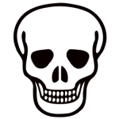

# Djambi ou l'échéquier de Machiavel

Inventé en 1975 par Jean Anesto, il s'agit d'un jeu de société se jouant de 2 à 6 joueurs, dès 12 ans.

## Matériel
Chaque joueur possède :
- 1 Chef
- 1 Assassin
- 1 Reporter
- 1 Nécromobile
- 1 Diplomate
- 4 Militants

Pour des soucis de simplification, nous n'implémenterons que le mode 2 et 4 joueurs. 
Mode 2 joueurs : Chaque joueur contrôle, dès le départ, deux couleurs aléatoirement réparties. 

Le jeu se joue sur un plateau de 9×9 cases.
La case centrale est nommée Labyrinthe. Aucune pièce, à part le Chef ne peut s’y arrêter.

Voici les positions de départ ainsi que le plateau.
<!-- style>
    #djambi_board tr{ height: 32px;}
    #djambi_board td{ width: 32px; border:1px solid black;}
    
    .laby{
        background-color: gray;
        background-image: url('assets/chef-150x150.png'); 
    }
    .yellow{
        background-color: yellow;
    }
    .green{
        background-color: lightgreen;
    }
    .blue{
        background-color: lightblue;
    }
    .red{
        background-color: tomato;
    }
    .peon{
        background-size:contain;
        background-repeat:no-repeat;
        background-position: center
    }
    .assassin{
        background-image: url('assets/assassin-150x150.png'); 
    }
    .militant{
        background-image: url('assets/militant-150x150.png'); 
    }
    .chief{
        background-image: url('assets/chef-150x150.png'); 
    }
    .diplomate{
        background-image: url('assets/diplomate-150x150.png'); 
    }
    .necromobile{
        background-image: url('assets/necromobile-150x150.png'); 
    }
    .reporter{
        background-image: url('assets/reporter-150x150.png'); 
    }
</style>
<table id='djambi_board'>
<tr><td class='peon green chief'></td><td class='peon green assassin'></td><td class='peon green militant'></td><td></td><td></td><td></td><td class='peon yellow militant'></td><td class='peon yellow assassin'></td><td class='peon yellow chief'></td></tr>

<tr><td class='peon green diplomate'></td><td class='peon green reporter'></td><td class='peon green militant'></td><td></td><td></td><td></td><td class='peon yellow militant'></td><td class='peon yellow reporter'></td><td class='peon yellow diplomate'></td></tr>
<tr><td class='peon green militant'></td><td class='peon green militant'></td><td class='peon green necromobile'></td><td></td><td></td><td></td><td class='peon yellow necromobile'></td><td class='peon yellow militant'></td><td class='peon yellow militant'></td></tr>
<tr><td></td><td></td><td></td><td></td><td></td><td></td><td></td><td></td><td></td></tr>
<tr><td></td><td></td><td></td><td></td><td class='peon laby'></td><td></td><td></td><td></td><td></td></tr>
<tr><td></td><td></td><td></td><td></td><td></td><td></td><td></td><td></td><td></td></tr>
<tr><td class='peon red militant'></td><td class='peon red militant'></td><td class='peon red necromobile'></td><td></td><td></td><td></td><td class='peon blue necromobile'></td><td class='peon blue militant'></td><td class='peon blue militant'></td></tr>
<tr><td class='peon red diplomate'></td><td class='peon red reporter'></td><td class='peon red militant'></td><td></td><td></td><td></td><td class='peon blue militant'></td><td class='peon blue reporter'></td><td class='peon blue diplomate'></td></tr>
<tr><td class='peon red chief'></td><td class='peon red assassin'></td><td class='peon red militant'></td><td></td><td></td><td></td><td class='peon blue militant'></td><td class='peon blue assassin'></td><td class='peon blue chief'></td></tr>
</table -->

## But du jeu
Un peu comme aux échecs, on joue chacun son tour, l'objectif étant d'éliminer tous les rivaux. Deux façons possibles :
- En tuant les Chefs ennemis.
    - Un joueur qui tue un chef s’approprie ses pièces.
- En encerclant les Chefs ennemis.
    - Les pièces d’un Chef encerclé sont récupérées par le 1er joueur à occuper le Labyrinthe. Vous pourrez encercler le chef ennemi par des cadavres. Celà sera expliqué plus tard.

## Les pions

Il en existe deux types :

- Les Tueurs : Chef, Militant, Assassin et Reporter.
- Les Déplaceurs : Diplomate et Nécromobile.

La particularité de ce jeu réside grandement dans le mécanisme suivant. Lorsqu'un pion A tue un pion B d'une couleur adverse, le pion B est retourné face mort et placé sur le plateau, sur un emplacement libre, selon les désirs du joueur détenteur du pion A. 

Les pions se déplacent en diagonales, en lignes ou en colonnes. n'importe quelle pièce vivante ou morte constitue un obstacle infranchissable.

### Le Chef 

- **Type :** Tueur
- **Déplacement :** Il se déplace dans toutes les directions (comme une dame aux échecs), d'autant de cases qu'il veut
- **Élimination :** Peut tuer des pièces en occupant leur cases. La pièce tuée est retournée et placée sur n’importe quelle case libre du plateau.
- **Pouvoir :** Peut occuper le Labyrinthe (les autres pièces ne font que le traverser).
Lorsqu’il occupe le labyrinthe, le Chef dispose d’un tour de jeu supplémentaire après chaque joueur.

### Le Militant

- **Type :** Tueur
- **Déplacement :** Contrairement aux autres pièces qui se déplacent d’autant de cases qu’elles veulent, le Militant ne parcourt que 2 cases maximum, dans toutes les directions.
- **Élimination :** Peut tuer des pièces en occupant leur case. La pièce tuée est retournée et placée sur n’importe quelle case libre du plateau.
Le militant est le seul (parmi les tueurs : Chef, Assassin et Reporter) à ne pas pouvoir tuer un Chef.

### L'Assassin

- **Type :** Tueur
- **Déplacement :** Il se déplace dans toutes les directions (comme une dame aux échecs), d'autant de cases qu'il veut
- **Élimination :** Peut tuer des pièces en occupant leur cases. La pièce tuée est retournée et placée sur la case qu’occupait l’Assassin avant son méfait.
- **Pouvoir :** Peut occuper le labyrinthe pour tuer un Chef. Il dispose alors d’un tour supplémentaire pour fuir le labyrinthe (aucune pièce à part le Chef ne peut rester dans le labyrinthe).

### Le Reporter

- **Type :** Tueur
- **Déplacement :** Il se déplace dans toutes les directions (comme une dame aux échecs), d'autant de cases qu'il faut
- **Élimination :** Tue après son déplacement la pièce adjacente à l’un de ses côtés (au choix). Les pièces tuées ne sont pas déplacées. Il n'est pas obligé de tuer. Ne peut tuer s’il est utilisé par un diplomate ennemi.

### Le Diplomate

- **Type :** Deplaceur
- **Déplacement :** Il se déplace dans toutes les directions (comme une dame aux échecs), d'autant de cases qu'il faut
- **Élimination :** N’élimine pas !
- **Pouvoir :** Lorsque le diplomate atterrit sur une pièce ennemie, cette dernière est alors replacée par le diplomate sur la case libre de son choix. Attention il ne peut agir qu'avec des pièces d'une autre couleur que la sienne.

### La Nécromobile

- **Type :** Deplaceur
- **Déplacement :** Il se déplace dans toutes les directions (comme une dame aux échecs), d'autant de cases qu'il faut. C'est le seul pion pouvant s'arrêter sur un mort.
- **Élimination :** N’élimine pas !
- **Pouvoir :** Lorsque le diplomate atterrit sur une pièce contenant un mort, cette dernière est alors replacée par le diplomate sur la case libre de son choix. La nécromobile peut venir "nettoyer" le labyrinthe, il dispose alors d’un tour supplémentaire pour fuir le labyrinthe (aucune pièce à part le Chef ne peut rester dans le labyrinthe).

## FAQ

### A partir de quel moment un Chef est-il considéré comme encerclé par des cadavres ?

L’encerclement est effectif dès lors qu’un Chef ou une de ses pièces adjacentes est entouré de cadavres et ne peut plus effectuer le moindre mouvement, (quand bien même un Nécromobile ami occuperait un autre endroit du plateau).

## Livraison attendue : 
Par le biais d'un dépôt git accessible par votre formateur : 
- Le code source de l'application
- Un executable du projet
- Un fichier README.md expliquant le projet (la raison d'être, des screenshots de l'application)
- Les tests unitaires du projet (Couverture à 50% minimum)

Votre application devra contenir : 
- Un jeu fonctionnel
- Une présentation des règles

Bonus :
 - Une CI permettant d'executer les tests unitaires
 - Possibilité de sauvegarder une partie

